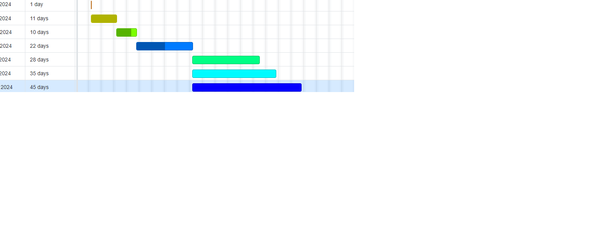

# Code Review Bot

## 4.1 SDP Plan Introduction

This Software Development Plan outlines the development process for the Intelligent Code Review Assistant project. The project aims to develop an automated code review assistant that enhances code quality through analysis and feedback. The plan includes details of activities to be conducted during development, as well as sub-task completion dates (milestones) from the master schedule.

## 4.1.1 Project Deliverables
Deliverable 1: Initial Project Setup
Explanation: Setup project repository, environment, and initial documentation.
Deliverable 2: Prototype Implementation
Explanation: Develop a prototype version of the code review assistant with basic functionality.
Deliverable 3: Code Analysis Code
Explanation: Implement code analysis module to parse code comments and structure.
Deliverable 4: Feedback
Explanation: Develop feedback generation module to provide insights and recommendations.
Deliverable 5: Integration and Testing
Explanation: Integrate modules, perform testing, and ensure functionality and quality.

## 4.2 Project Resources

## 4.2.1 Hardware Resources

Development Machine:
Specifications: Windows 10/11
Python 3.11+

## 4.2.2 Software Resources

Text Editor: Visual Studio Code
Python Interpreter: 3.11
Development Libraries: spaCy, NLTK, GitPython
Version Control System: Git

## 4.3 Project Organization/Human Resources

The project is structured based on major functions and responsibilities:

Code Analysis Module: Responsible for parsing code comments and structure.
Feedback Generation Module: Responsible for providing insights and recommendations.
Integration and Testing: Responsible for integrating modules and ensuring quality.

## 4.4.1 Gantt

## 4.4.2

| Task        | Member      | Software Resources          |
| ----------- | ----------- | ----------------------------|
| Setup       | Me          | Text editor                 |
| Prototype   | Me          | Python Interpretor/IDE      |
| Code        | Me          | Coding of the bot           |
| Feedback    | Me          | Feedback from users         |
| Testing     | Me          | Testing                     |
